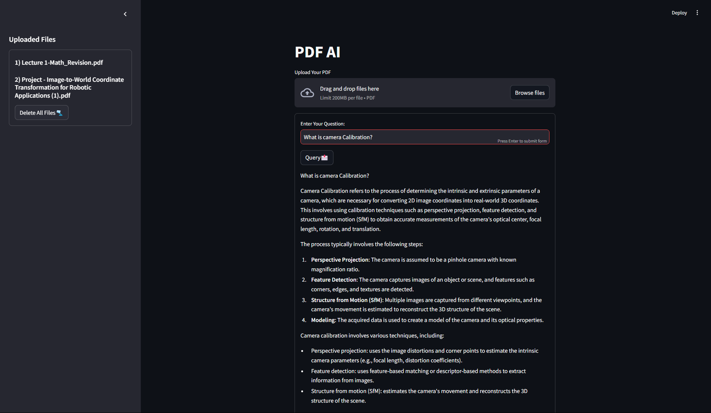

```markdown
# PDF AI - RAG-powered Document Assistant 📚🤖



A modern Retrieval-Augmented Generation (RAG) system for PDF document analysis, powered by **Ollama 3.2:1b**, **ChromaDB**, and **Nomic Embeddings**. Built with **Streamlit** for seamless web interaction.

Inspired by [pixegami's RAG tutorial](https://github.com/pixegami/rag-tutorial-v2), enhanced with production-ready improvements and a user-friendly interface.

---

## Features ✨

- 🖥️ **Streamlit-powered web interface** for intuitive document management
- 📄 **Multi-PDF processing** with intelligent chunking using **RecursiveCharacterTextSplitter**
- 🔍 **Semantic search** powered by **Nomic Embeddings** and **ChromaDB**
- 🧠 **Context-aware question answering** using **RAG architecture** with **Ollama 3.2:1b**
- 🗃️ **Optimized ChromaDB integration** for efficient vector storage and retrieval
- 🧹 **One-click database cleanup** and document purge
- 📖 **Source citation tracking** for answer verification

---

## Technical Stack 🛠️

### Core Components
- **Embeddings**: `nomic-embed-text` for high-quality document embeddings
- **Vector Database**: **ChromaDB** for efficient storage and retrieval
- **LLM**: **Ollama 3.2:1b** for response generation
- **Text Splitting**: **RecursiveCharacterTextSplitter** for optimal chunking of documents
- **Web Framework**: **Streamlit** for interactive web UI

### RAG Pipeline
1. **Document Ingestion**:
   - PDFs are loaded and split into chunks using **RecursiveCharacterTextSplitter**.
   - Chunks are embedded using **nomic-embed-text**.
   - Embedded chunks are stored in **ChromaDB** for efficient retrieval.

2. **Query Processing**:
   - User queries are embedded using the same **nomic-embed-text** model.
   - The system performs a **similarity_search_with_score** in ChromaDB to retrieve relevant document chunks.

3. **Response Generation**:
   - Retrieved chunks are passed to **Ollama 3.2:1b** for context-aware response generation.
   - Sources are tracked and formatted for user reference.

---

## Installation ⚙️

1. Clone the repository:
```bash
git clone https://github.com/Shift118/pdf-ai-rag.git
cd pdf-ai-rag
```

2. Install dependencies:
```bash
pip install -r requirements.txt
```

3. Set up Ollama:
Just make sure Ollama is running in background

4. Create data directories:
```bash
mkdir -p data/books
```

---

## Usage 🚀

1. Start the Streamlit app:
```bash
streamlit run app.py
```

2. In the web interface:
   - Upload PDFs through the sidebar
   - Wait for document processing (≈30-60 sec/doc)
   - Enter natural language questions in the main interface
   - View answers with source document citations

3. Manage documents:
   - Delete individual files through the sidebar
   - Use "Delete All Files" for complete reset

---

## Technical Enhancements 🛠️

Compared to the original implementation:
- **Streamlit Interface**: Modern web UI with real-time feedback
- **Database Optimization**: Improved ChromaDB handling with:
  - Better persistence management
  - Enhanced error handling
  - Efficient chunk processing
- **Query System**: Upgraded RAG pipeline with:
  - Context-aware response generation
  - Source citation formatting
  - Batch processing optimizations
- **System Architecture**: Modular code structure for maintainability

---

## License 📄
This project is open source under the [MIT License](LICENSE).

---

## Acknowledgments 🙏
- Inspired by [pixegami's RAG tutorial](https://github.com/pixegami/rag-tutorial-v2)
- Powered by [Ollama](https://ollama.ai/), [ChromaDB](https://www.trychroma.com/)
- Built with [Streamlit](https://streamlit.io/) and [LangChain](https://www.langchain.com/)
